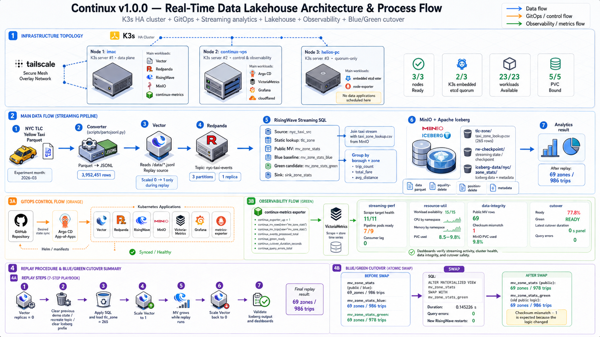
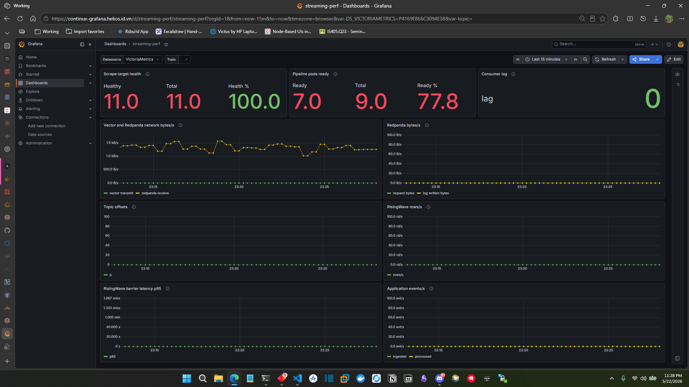
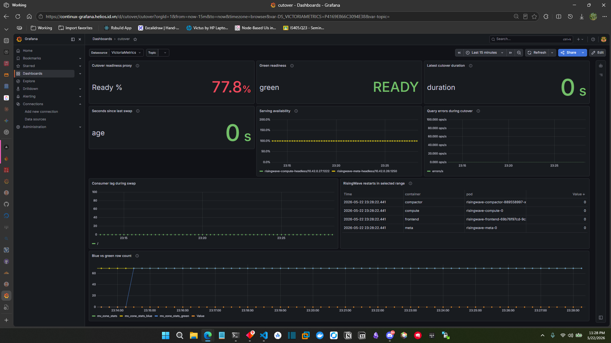
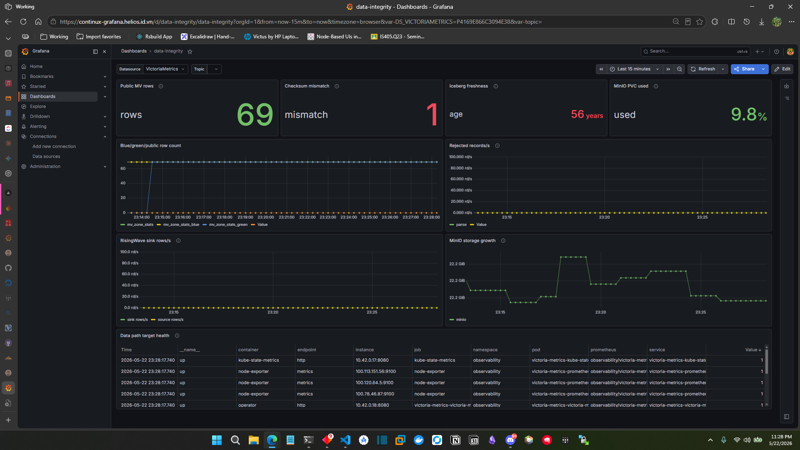
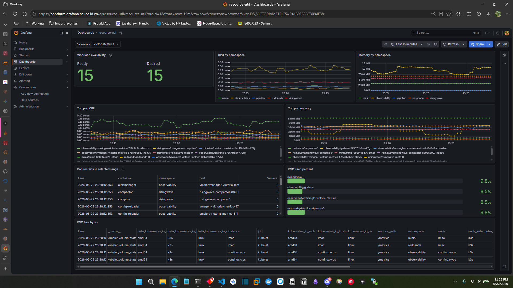

# XÂY DỰNG KIẾN TRÚC DATA LAKEHOUSE THỜI GIAN THỰC CHO HỆ THỐNG GIAO THÔNG THÔNG MINH TRÊN CỤM KUBERNETES

**Building a Real-Time Data Lakehouse Architecture for Intelligent Transportation Systems on a Kubernetes Cluster**

**Trường:** Trường Đại học Công nghệ Thông tin, Đại học Quốc gia TP.HCM<br>
**Môn học:** Cơ sở dữ liệu phân tán và Dữ liệu lớn<br>
**Mã lớp:** IS211.Q22 và IS405.Q23<br>
**Giảng viên hướng dẫn:** ThS. Nguyễn Hồ Duy Trí<br>
**Sinh viên thực hiện:** Ngô Tiến Sỹ - 23521367; Nguyễn Văn Nam - 23520982<br>
**Năm:** 2026

---

## Tóm Tắt

Các hệ thống giao thông thông minh cần tiếp nhận và tổng hợp dữ liệu phát sinh liên tục, đồng thời cần thay đổi logic phân tích mà không làm gián đoạn khả năng truy vấn đang phục vụ. Nghiên cứu này thiết kế và đánh giá **Continux**, một kiến trúc Data Lakehouse thời gian thực chạy trên cụm K3s ba server có tài nguyên giới hạn. Pipeline sử dụng dữ liệu NYC TLC Yellow Taxi tháng `2026-03`, chuyển đổi Parquet sang JSONL, phát sự kiện bằng Vector, trung chuyển qua Redpanda, xử lý bằng RisingWave streaming SQL, ghi kết quả theo Apache Iceberg trên MinIO, quản lý triển khai bằng Argo CD và quan sát qua VictoriaMetrics/Grafana.

Theo phương pháp Design Science Research, nghiên cứu xây dựng artifact kiến trúc và đánh giá qua một lượt replay có kiểm soát cùng kịch bản Blue/Green materialized view (MV) cutover. Dataset nguồn sau chuyển đổi có `3.952.451` dòng; lượt thực nghiệm được dừng có chủ đích sau khi public MV đạt `69` vùng và `986` chuyến, không phải phép xử lý toàn bộ dataset. Trước cutover, public/blue MV có kết quả `69/986`, còn green MV áp dụng bộ lọc chất lượng dữ liệu đạt `69/978`. Runbook ghi duration của lệnh `ALTER MATERIALIZED VIEW ... SWAP WITH ...` là `0,145226 s`; vòng lặp truy vấn không ghi nhận lỗi, các thành phần RisingWave không restart và public MV sau swap phản ánh logic green.

Kết quả chứng minh tính khả thi của **zero-downtime quan sát được ở lớp truy vấn** trong cửa sổ thực nghiệm, đồng thời cho thấy một pipeline lakehouse có thể vận hành trên cụm K3s nhỏ với GitOps và quan sát tập trung. Nghiên cứu không tuyên bố đã kiểm chứng Exactly-Once end-to-end, vì evidence hiện có không bao gồm phép đối chiếu offset, duplicate hoặc loss trên toàn đường dữ liệu; cũng không kết luận Iceberg sink tự chuyển phụ thuộc theo logic green sau thao tác đổi tên MV.

**Từ khóa:** Data Lakehouse, stream processing, Materialized View, Blue/Green cutover, RisingWave, Apache Iceberg, GitOps, K3s, ITS.

## Abstract

Intelligent transportation systems must continuously ingest and aggregate event data while allowing analytical logic to evolve without interrupting serving queries. This study designs and evaluates **Continux**, a real-time data lakehouse architecture deployed on a resource-constrained three-server K3s cluster. The pipeline uses the March 2026 NYC TLC Yellow Taxi dataset, converts Parquet records to JSONL, replays events through Vector and Redpanda, processes streaming SQL in RisingWave, delivers results to Apache Iceberg on MinIO, manages deployment with Argo CD, and observes runtime behavior with VictoriaMetrics and Grafana.

Following Design Science Research, the study evaluates an architectural artifact through one controlled replay and a Blue/Green materialized-view cutover scenario. The converted source dataset contains `3,952,451` records; the measured replay was deliberately stopped when the public materialized view reached `69` zones and `986` trips and therefore does not represent full-dataset processing. Before cutover, the public/blue views yielded `69/986`, whereas the green view, which applied additional data-quality filters, yielded `69/978`. The runbook records a `0.145226 s` duration for `ALTER MATERIALIZED VIEW ... SWAP WITH ...`, with no query errors observed by the query loop and no RisingWave restarts.

The results demonstrate **observed query-layer zero-downtime** within the experimental window and the feasibility of operating a GitOps-observed streaming lakehouse on a small K3s cluster. This study does not claim independently verified end-to-end exactly-once processing, because the available evidence does not reconcile offsets, duplicates, or record loss across the complete path; nor does it claim that the Iceberg sink dependency automatically followed the green logic after the materialized-view name swap.

**Keywords:** Data Lakehouse, stream processing, Materialized View, Blue/Green cutover, RisingWave, Apache Iceberg, GitOps, K3s, ITS.

---

---

# Chương 1: Giới Thiệu Tổng Quan

## 1.1 Đặt Vấn Đề

Dữ liệu giao thông đô thị có đặc điểm phát sinh liên tục và mang ý nghĩa vận hành tức thời: mỗi chuyến xe bổ sung thông tin về điểm đón, quãng đường, chi phí và nhu cầu theo khu vực. Với một hệ thống giao thông thông minh, gọi tắt là ITS (*Intelligent Transportation System*), việc lưu dữ liệu chỉ để phân tích theo batch là chưa đủ; người vận hành cần theo dõi tổng hợp cập nhật gần thời gian thực và cần thay đổi quy tắc phân tích khi yêu cầu chất lượng dữ liệu hoặc chính sách nghiệp vụ thay đổi. ``Cập nhật gần thời gian thực'' ở đây nghĩa là kết quả phải phản ánh sự kiện gần nhất trong khoảng từ giây đến vài chục giây, thay vì sau một lần chạy batch định kỳ.

Trong xử lý batch, hệ thống gom một lượng dữ liệu rồi tính toán theo một lịch định trước; kết quả vì vậy thường phản ánh quá khứ sau một độ trễ. Ngược lại, xử lý luồng (*stream processing*) xem mỗi bản ghi mới là một *event* — một thông điệp có thể cập nhật kết quả đang phục vụ ngay khi đến. Thành phần then chốt cho phép thực hiện điều này ở lớp phân tích là *materialized view* (MV): trong khi một view thông thường chỉ là định nghĩa truy vấn được chạy lại mỗi lần đọc, một materialized view là kết quả truy vấn được hệ thống duy trì sẵn và cập nhật theo thay đổi đầu vào. Với ITS, khác biệt này quan trọng vì thống kê nhu cầu theo vùng chỉ hỗ trợ vận hành tốt khi được quan sát đủ sớm và khi định nghĩa tổng hợp có thể thay đổi an toàn ngay khi đang phục vụ.

Data Lakehouse là mô hình kiến trúc kết hợp tính linh hoạt của *data lake* (lưu trữ tệp mở trên object storage chi phí thấp) với quản trị bảng và khả năng phân tích có cấu trúc kiểu *data warehouse*, được đề xuất chính thức trong nghiên cứu của Armbrust và cộng sự (2021). Trong khi đó, xử lý luồng đưa thêm vào chuỗi vận hành các thành phần như *broker* (lớp trung gian lưu và phân phối thông điệp), engine tính toán, *state store* (nơi giữ trạng thái trung gian), *sink* (đầu ra ghi xuống một hệ thống đích) và lớp quan sát. Ursa chỉ ra chi phí và độ phức tạp khi streaming và lakehouse bị tách rời, đồng thời đề xuất một engine lakehouse-native cho Kafka (Merli et al., 2025). Tại lớp ứng dụng phân tích vẫn còn một câu hỏi thực hành chưa được trả lời rộng rãi: khi logic tổng hợp đang phục vụ truy vấn phải thay đổi, việc chuyển đổi có thể thực hiện mà không ghi nhận lỗi truy vấn hay không?

## 1.2 Lý Do Chọn Đề Tài

Continux đặt câu hỏi nêu trên trong bối cảnh khả thi với phòng thí nghiệm: một cụm Kubernetes nhẹ tên K3s, dữ liệu taxi mở của Sở Taxi và Dịch vụ vận tải New York (NYC TLC) và các công nghệ nguồn mở thông dụng. K3s là một bản phân phối Kubernetes gọn nhẹ do SUSE phát hành, có khả năng chạy trên máy có tài nguyên hạn chế; lựa chọn K3s giúp đề tài tái hiện được nhiều khái niệm cốt lõi của Kubernetes mà không yêu cầu hạ tầng đám mây quy mô lớn. Đề tài có liên hệ với các Mục tiêu Phát triển Bền vững (*Sustainable Development Goal*, SDG) của Liên Hợp Quốc: SDG 8 qua nhu cầu hạ tầng dữ liệu hỗ trợ dịch vụ di chuyển hiệu quả; SDG 9 qua thử nghiệm hạ tầng số và đổi mới công nghệ; SDG 11 qua khả năng quan sát dữ liệu di chuyển phục vụ đô thị bền vững (United Nations, n.d.-a, n.d.-b, n.d.-c). Liên hệ này là động lực ứng dụng, không phải đánh giá định lượng tác động SDG.

Về nghiên cứu, Ursa nhấn mạnh đường ghi lakehouse-native và bảo đảm xử lý của streaming engine. Continux không tái hiện benchmark chi phí của Ursa; thay vào đó, đề tài khảo sát *lớp vận hành* (operational layer) phía trên ingest, bao gồm GitOps cho triển khai, dashboard cho quan sát, và một kỹ thuật thay đổi logic truy vấn dùng hai materialized view song song cùng phép *swap* tên trong RisingWave — streaming database SQL được trình bày chi tiết ở Chương 2.

## 1.3 Mục Tiêu Nghiên Cứu

Nghiên cứu hướng tới bốn mục tiêu phối hợp với nhau, đi từ thiết kế đến đánh giá. *Thứ nhất*, thiết kế một pipeline streaming lakehouse hoàn chỉnh từ dữ liệu NYC TLC tới đầu ra theo định dạng bảng Apache Iceberg trên object storage. *Thứ hai*, triển khai pipeline đó trên một cụm K3s sẵn sàng cao (*high availability*, HA) gồm ba server, có phân tách rõ ràng giữa *data plane* (các thành phần xử lý dữ liệu), *control/observability plane* (điều khiển và quan sát), và một node chỉ giữ vai trò *quorum-only* — tức tham gia bỏ phiếu để cụm đạt đồng thuận chứ không chạy workload dữ liệu. *Thứ ba*, thực hiện một kịch bản Blue/Green cutover tại lớp public materialized view và quan sát thời gian chuyển đổi, lỗi truy vấn cũng như trạng thái workload trong cửa sổ đó. *Thứ tư*, đánh giá artifact bằng đúng evidence đã thu thập, không mở rộng kết luận vượt quá dữ liệu đo được.

## 1.4 Đối Tượng Và Phạm Vi

Đối tượng xử lý là dữ liệu công khai NYC TLC Yellow Taxi tháng `2026-03` và bảng tra cứu khu vực Taxi Zone Lookup. Tệp Parquet nguồn (định dạng cột nén tối ưu cho phân tích) được chuyển thành JSONL — một tệp văn bản trong đó mỗi dòng là một bản ghi JSON độc lập — gồm `3.952.451` dòng. Trong lượt thực nghiệm được báo cáo, công cụ phát sự kiện Vector được bật có kiểm soát rồi dừng để bảo toàn tài nguyên của cụm lab, khiến kết quả MV cuối phản ánh `986` chuyến chứ không phải toàn bộ tệp.

Phạm vi công nghệ được khảo sát gồm Vector (nguồn phát sự kiện), Redpanda (broker tương thích Kafka), RisingWave (streaming SQL engine với materialized view), MinIO kết hợp Apache Iceberg (object storage và table format), Argo CD (công cụ GitOps cho Kubernetes), VictoriaMetrics (cơ sở dữ liệu time series), Grafana (lớp trực quan hóa metric), và K3s (bản phân phối Kubernetes nền). Phạm vi đánh giá cutover được giới hạn ở tên truy vấn public `mv_zone_stats`; báo cáo không kiểm chứng rằng đường ghi xuống Iceberg sink phía sau tự chuyển sang logic green nhờ phép đổi tên materialized view.

## 1.5 Câu Hỏi Nghiên Cứu

**Bảng 1. Câu hỏi nghiên cứu và evidence trả lời**

| ID | Câu hỏi nghiên cứu | Evidence hiện có | Kết luận trong phạm vi đo |
|---|---|---|---|
| RQ1 | Có thể chuyển public analytical logic mà không ghi nhận lỗi truy vấn trong cửa sổ swap không? | Runbook ghi duration `0,145226 s`; query errors `0` | Có, ở lớp truy vấn và trong cửa sổ quan sát |
| RQ2 | Pipeline có tạo output lakehouse quan sát được không? | MinIO listing có data Parquet, equality-delete, position-delete và metadata | Có, sau lượt replay |
| RQ3 | Cụm tài nguyên giới hạn có vận hành được kịch bản đã thiết kế không? | `3/3` node, `5/5` PVC, `23/23` workload | Có, cho lượt replay/cutover báo cáo |
| RQ4 | Exactly-Once end-to-end có được thực nghiệm xác nhận không? | Không có reconciliation duplicate/loss/offset | Chưa thể kết luận |

## 1.6 Đóng Góp Của Đề Tài

Đề tài đóng góp bốn nội dung gắn kết với nhau. Thứ nhất là một artifact streaming lakehouse có thể tái hiện trên cụm K3s ba server, triển khai bằng GitOps — tức cách vận hành mà toàn bộ trạng thái mong muốn được mô tả khai báo trong Git và một agent (ở đây là Argo CD) đảm bảo cụm luôn về đúng trạng thái đó; stack được chọn không phụ thuộc JVM tại lớp broker/streaming chính (Redpanda và RisingWave). Thứ hai là một kịch bản Blue/Green MV swap được đo trong khi public query vẫn được gọi liên tục, cho thấy query loop không ghi nhận lỗi trong thao tác swap đã đo. Thứ ba là bộ dashboard quan sát kèm cách diễn giải cụ thể cho cutover, tài nguyên và data integrity theo từng giai đoạn xử lý. Thứ tư là một phân tích giới hạn bằng chứng nhằm tách rõ *năng lực công nghệ được tài liệu hóa* khỏi *kết quả đã đo được tại artifact*.

## 1.7 Cấu Trúc Báo Cáo

Chương 2 trình bày nền tảng và bài báo Ursa. Chương 3 mô tả phương pháp, dữ liệu và kiến trúc Continux. Chương 4 báo cáo kết quả thực nghiệm đã ghi nhận. Chương 5 thảo luận mức độ trả lời câu hỏi nghiên cứu, giới hạn và kết luận. Phụ lục ghi các đoạn SQL/YAML cốt lõi cùng chỉ mục evidence.

---

# Chương 2: Cơ Sở Lý Thuyết

## 2.1 Data Warehouse, Data Lake Và Data Lakehouse

*Data warehouse* thường đưa dữ liệu vào các bảng được quản trị chặt để phục vụ truy vấn phân tích ổn định: schema được kiểm soát, các phép biến đổi ETL (*Extract — Transform — Load*) thực hiện trước khi dữ liệu vào kho, và engine truy vấn hoạt động trên dữ liệu đã được làm sạch. Ngược lại, *data lake* lưu các tệp đa dạng (CSV, JSON, Parquet, Avro…) trên storage chi phí thấp mà không bắt buộc lược đồ chung; dữ liệu dễ vào kho nhưng quản trị ở lớp bảng có thể thiếu. Mô hình *lakehouse* kết hợp hai hướng: dữ liệu vẫn nằm trên định dạng mở của data lake, nhưng được bổ sung một lớp bảng có *metadata*, lịch sử phiên bản và ngữ nghĩa giao dịch theo nguyên tắc ACID (*Atomicity, Consistency, Isolation, Durability*), để nhiều engine khác nhau có thể đọc cùng một kết quả nhất quán (Armbrust et al., 2021).

*Object storage* là lớp lưu trữ trong đó dữ liệu được truy cập theo khóa (*key*) qua API HTTP — thường tương thích giao diện Amazon S3 — thay vì qua đường dẫn tệp truyền thống; mỗi object là một tập hợp byte kèm metadata. Trong artifact, MinIO cung cấp endpoint tương thích S3 cho cả checkpoint lẫn bảng Iceberg. Apache Iceberg không phải một cơ sở dữ liệu chạy truy vấn mà là một *table format* — đặc tả mô tả những tệp dữ liệu nào thuộc một bảng, *snapshot* nào (ảnh chụp trạng thái bảng tại một thời điểm) là hiện hành, và *manifest* (tệp metadata trung gian liệt kê các tệp dữ liệu) nào cho phép theo dõi thay đổi (Apache Software Foundation, n.d.-a). Iceberg phân biệt hai loại object xóa: *equality-delete* đánh dấu xóa theo giá trị khóa, *position-delete* đánh dấu xóa theo vị trí dòng trong tệp; hai cơ chế này phục vụ cập nhật theo kiểu upsert. Vì vậy, khi báo cáo nói output lakehouse tồn tại, bằng chứng cụ thể là các tệp Parquet và metadata Iceberg do sink ghi trên MinIO, không phải khẳng định rằng MinIO tự xử lý SQL.

## 2.2 Xử Lý Luồng, State Và Materialized View

Một *event* trong pipeline của đề tài là bản ghi chuyến taxi được phát lại dưới dạng thông điệp JSON. Xử lý luồng cập nhật kết quả tại thời điểm event đến, thay vì chờ một batch hoàn chỉnh. Đối tượng phục vụ kết quả gần thời gian thực ở đây là *materialized view* (MV): trong khi một view thông thường chỉ là định nghĩa truy vấn được chạy lại mỗi lần đọc, một materialized view là kết quả truy vấn được hệ thống duy trì sẵn và cập nhật theo thay đổi đầu vào; người đọc nhận ngay bảng tổng hợp hiện hành mà không phải tính lại từ dữ liệu thô. Với dữ liệu taxi, MV được nhóm theo `borough` (quận) và `zone` (khu vực TLC) và cung cấp các trường `trip_count` (số chuyến), `total_fare` (tổng cước) và `avg_distance` (quãng đường trung bình).

Phép join với bảng tra cứu khu vực và phép aggregation theo vùng đều cần *state*, tức thông tin trung gian phải được giữ qua nhiều event để cập nhật chính xác. *Checkpoint* là điểm lưu trạng thái có chủ đích để engine có cơ sở tiếp tục hoặc khôi phục xử lý sau gián đoạn. Liên quan đến semantics, một pipeline có thể là *at-least-once* (mỗi event được xử lý ít nhất một lần, cho phép trùng lặp), *at-most-once* (cho phép mất event), hoặc *exactly-once* (mỗi event tác động lên kết quả đúng một lần). Tính *idempotent* — nghĩa là áp dụng cùng một thao tác nhiều lần cho cùng kết quả — thường được khai thác để biến at-least-once thành tương đương exactly-once tại sink. Continux cấu hình RisingWave dùng MinIO bucket `rw-checkpoint` cho state/checkpoint; cấu hình này mô tả nơi giữ state, nhưng bản thân nó chưa chứng minh khả năng phục hồi hay Exactly-Once end-to-end của artifact.

## 2.3 Message Broker Và Event Streaming

Kafka đã định hình mô hình log phân tán cho streaming. Trong mô hình này, *topic* là một luồng thông điệp có tên (giống như một ``ống'' chứa các message cùng loại), *partition* là phần chia của topic phục vụ thứ tự cục bộ và xử lý song song, còn *offset* là vị trí thứ tự của một thông điệp trong một partition (Kreps et al., 2011). *Producer* là phía ghi message vào topic, *consumer* là phía đọc; consumer ghi nhớ offset đã đọc để có thể tiếp tục mà không đọc lại. Continux dùng Redpanda — một broker được viết bằng C++ nhưng tương thích Kafka API — để tách công cụ phát replay Vector (producer) khỏi RisingWave (consumer). Nhờ lớp trung gian này, phía phát replay và phía tính toán không cần chạy cùng nhịp; nếu RisingWave xử lý chậm hơn Vector phát, message vẫn được Redpanda đệm trong topic.

Topic `nyc-taxi-events` được cấu hình với `3` partition, `1` replica và retention `24` giờ. Ba partition mô tả cách luồng được chia để có thể xử lý song song, còn một replica nghĩa là hệ thống không đo khả năng chịu mất broker node như cấu hình production HA — nếu mất broker node, dữ liệu trong topic không có bản sao dự phòng. Do evidence hiện tại cũng chưa đối chiếu offset xuyên suốt đường dữ liệu, báo cáo không coi Exactly-Once là kết quả đã thực nghiệm xác nhận end-to-end.

## 2.4 RisingWave Và Apache Iceberg

RisingWave tiếp nhận source Kafka-compatible, join với bảng lookup đặt trên storage tương thích S3, duy trì các materialized view và tạo Iceberg sink để ghi kết quả ra lakehouse. Tài liệu RisingWave nêu Iceberg sink có tùy chọn exactly-once delivery, mặc định bật khi sink decoupling còn bật (RisingWave Labs, n.d.-c). ``Sink decoupling'' là cơ chế tách lịch ghi xuống sink khỏi nhịp tính toán MV để cải thiện độ ổn định. Đây là năng lực được tài liệu hóa ở connector/cấu hình, không phải phép đo độc lập về toàn đường dữ liệu trong Continux.

RisingWave cũng cung cấp cú pháp `ALTER MATERIALIZED VIEW ... SWAP WITH ...` cho phép đổi tên hai MV như một thao tác đổi tên ở lớp metadata (RisingWave Labs, n.d.-a). Tài liệu về thay đổi streaming job lưu ý các dependency như sink cần được xem xét riêng khi logic upstream thay đổi (RisingWave Labs, n.d.-b). Do đó báo cáo giới hạn kết luận swap tại endpoint truy vấn public, không mở rộng sang hành vi của Iceberg sink phía sau.

## 2.5 Blue/Green Deployment Và Atomic Name Swap

*Blue/Green deployment* là một mẫu triển khai trong đó hai phiên bản của cùng một dịch vụ được duy trì song song: *blue* là phiên bản đang phục vụ thực tế, còn *green* là ứng viên thay thế đã chuẩn bị sẵn nhưng chưa được public truy cập. Khi ứng viên đạt yêu cầu, ``*cutover*'' là thao tác chuyển điểm truy cập công khai từ blue sang green; trong trường hợp chỉ đổi định danh, thao tác đó được gọi là ``*swap*''. Ở Continux, đơn vị chuyển không phải Kubernetes deployment mà là logic MV: `mv_zone_stats` là tên public mà client tiếp tục gọi sau cutover; `mv_zone_stats_blue` (baseline) giữ tất cả record đã join được; `mv_zone_stats_green` loại các chuyến có `fare_amount` hoặc `trip_distance` âm.

Phép swap tên cho phép client giữ nguyên SQL gọi đến tên public. Tính nguyên tử tại metadata của thao tác swap chỉ mô tả điều client truy vấn MV quan sát được — nghĩa là client thấy việc đổi tên là tức thời và không có trạng thái trung gian; nó không thay thế cho một kiểm thử toàn bộ downstream dependency như Iceberg sink.

## 2.6 GitOps Và Observability

OpenGitOps xác định bốn nguyên tắc cho trạng thái mong muốn: phải có tính *khai báo* (mô tả ``muốn gì'' thay vì ``làm như thế nào''), được *phiên bản hóa* trong Git, được *agent* tự động kéo về, và được *reconcile* liên tục — nghĩa là agent so tài nguyên đang chạy với manifest mong muốn rồi sửa sai lệch để đưa hệ thống về đúng cấu hình (OpenGitOps Working Group, n.d.). Continux dùng Argo CD theo mẫu *App-of-Apps*, trong đó một Application gốc trỏ tới thư mục chứa các Application con; cách tổ chức này giúp toàn bộ cụm được khởi tạo và đồng bộ chỉ bằng một điểm vào duy nhất. Thao tác scale Vector trong replay là hành động runtime có chủ đích diễn ra ngoài đường GitOps, không thay thế vai trò của Git làm nguồn cấu hình dài hạn.

*Observability* là khả năng suy luận trạng thái nội tại của hệ thống từ tín hiệu đo bên ngoài như metric, log và trạng thái workload. *Metric* là một chuỗi số có dấu thời gian — gọi là *time series* — mô tả một đại lượng theo thời gian; metric thường được *scrape* (cào lấy) bởi một backend từ endpoint HTTP do workload hoặc một *exporter* (thành phần dịch chỉ số nội bộ sang định dạng metric chuẩn) phát ra. VictoriaMetrics đảm nhiệm vai trò backend time-series cho artifact; Grafana cung cấp bốn dashboard: streaming performance, resource utilization, cutover và data integrity; còn exporter của Continux chuyển các SQL count và kết quả cutover thành metric chuẩn để VictoriaMetrics scrape. Dashboard được dùng làm evidence quan sát, có đối chiếu với output SQL và MinIO listing thay vì làm nguồn kết luận duy nhất.

## 2.7 Bài Báo Nền Tảng Ursa

Ursa là streaming engine leaderless, Kafka-compatible và lakehouse-native, ghi vào open table formats trên object storage. Bài báo tập trung vào giảm chi phí cross-AZ, disk replication và connector overhead trong mô hình truyền thống, đồng thời báo cáo throughput, near-real-time latency và exactly-once semantics của thiết kế Ursa (Merli et al., 2025).

Continux kế thừa động lực tích hợp streaming/lakehouse nhưng không triển khai Ursa và không so sánh chi phí với Kafka. Khoảng trống Continux khảo sát là vận hành thay đổi logic phân tích trên một stack triển khai thực: versioned manifests, dashboard và phép cutover MV có public query liên tục.

## 2.8 Nghiên Cứu Liên Quan

Flink hỗ trợ xử lý batch và stream trong một engine (Carbone et al., 2015), còn Kafka Streams và ksqlDB đặt xử lý gần hệ sinh thái Kafka. RisingWave trong đề tài được chọn vì giao diện SQL/MV và cú pháp swap phù hợp artifact. Phần so sánh này nhằm định vị phương pháp, không phải benchmark thực nghiệm giữa các hệ thống.

**Bảng 2. Vai trò của các lớp công nghệ trong Continux**

| Lớp | Công nghệ | Vai trò được đánh giá |
|---|---|---|
| Orchestration | K3s, Argo CD | Chạy workload và đồng bộ cấu hình |
| Ingestion | Vector | Replay JSONL có kiểm soát |
| Event broker | Redpanda | Topic Kafka-compatible |
| Stream compute | RisingWave | Join, aggregation, public/blue/green MV |
| Lakehouse storage | MinIO, Iceberg | State/checkpoint và output table objects |
| Observation | VictoriaMetrics, Grafana, exporter | Đo MV count, swap, health và resource |

---

# Chương 3: Phương Pháp Và Kiến Trúc Hệ Thống

## 3.1 Phương Pháp Nghiên Cứu

Nghiên cứu áp dụng phương pháp Design Science Research (DSR) (Hevner et al., 2004), một khung phương pháp luận cho nghiên cứu hệ thống thông tin trong đó tri thức được tạo ra thông qua việc xây dựng và đánh giá những hiện vật kỹ thuật. Theo DSR, một *artifact* là hiện vật kỹ thuật được thiết kế có chủ đích để xử lý một vấn đề cụ thể; ở đây artifact là toàn bộ kiến trúc Continux gồm hạ tầng K3s, pipeline streaming từ Vector đến Iceberg, lớp GitOps Argo CD và lớp quan sát VictoriaMetrics/Grafana. *Evaluation* là pha đánh giá artifact bằng lượt thực nghiệm được ghi lại trong `docs/RUNBOOK.md`, `docs/REPORT.md` và ảnh dashboard, thay vì chỉ mô tả cấu hình kỳ vọng trên giấy.

Evidence dùng cho evaluation gồm output dạng văn bản của lệnh shell, metric ở định dạng JSON do VictoriaMetrics trả về, và ảnh dashboard Grafana. Bộ output sinh trên host triển khai (node `imac`) được sao chép về máy phân tích Windows tại thư mục `evidence/finalize/20260522-151720/` để đối chiếu trong khi viết báo cáo. Đánh giá chỉ sử dụng đúng trạng thái, số đếm và thời gian có trong evidence; các mục không có phép đo tương ứng — như reconciliation Exactly-Once hay benchmark theo ba mức tải định trong repo — được xác định là giới hạn của nghiên cứu chứ không được nội suy.

## 3.2 Nguồn Dữ Liệu Và Chuẩn Bị Luồng

NYC TLC cung cấp dữ liệu trip record công khai cho taxi New York (New York City Taxi and Limousine Commission, n.d.). Continux sử dụng:

| Thành phần dữ liệu | Giá trị |
|---|---|
| Loại chuyến | Yellow Taxi |
| Tháng dữ liệu | `2026-03` |
| Định dạng nguồn | Parquet |
| File sau chuyển đổi | JSONL, `3.952.451` dòng |
| Bảng lookup | TLC Taxi Zone, `265` dòng, được upload lên MinIO |
| Lượt đo báo cáo | Replay có kiểm soát, public MV cuối `986` trips |

Script `scripts/partojsonl.py` trích các thuộc tính thời gian đón, khu vực đón/trả, fare và distance. Mỗi dòng JSONL biểu diễn một chuyến; khi Vector phát dòng đó vào broker, nó trở thành event trong lượt replay. Vector bổ sung hai trường meta khi phát: `event_id` (định danh duy nhất cho mỗi event được phát) và `event_time` (mốc thời gian phát thực tế của Vector). Trong lượt đánh giá, rate limit thực tế trong manifest là `2` sự kiện/giây để cụm lab tài nguyên hạn chế xử lý ổn định; Vector được dừng sau khi đủ quan sát cho demo. Vì vậy số trips trong kết quả không phải số lượng toàn bộ JSONL, dù số dòng nguồn đã được xác nhận độc lập bằng lệnh `wc -l` trên host `imac`; phân tích chi tiết hơn về chất lượng dataset thô được trình bày ở mục 4.3 của Chương 4.

## 3.3 Kiến Trúc Tổng Thể



**Hình 1.** Kiến trúc Continux gồm ba luồng song song: dữ liệu, điều khiển GitOps và quan sát.

Luồng nghiệp vụ chính:

```text
NYC TLC Parquet -> JSONL -> Vector -> Redpanda -> RisingWave
                 -> public MV -> Iceberg sink trên MinIO
```

Luồng điều khiển:

```text
GitHub repository -> Argo CD -> Kubernetes applications
```

Luồng quan sát:

```text
Workloads + continux-metrics -> VictoriaMetrics -> Grafana
```

Ba luồng được tách để tránh nhầm phạm vi kết luận: object Iceberg cho biết đường ghi dữ liệu đã chạy; trạng thái Argo CD cho biết cấu hình triển khai cốt lõi được reconcile; còn query loop và metric cutover cho biết tên public MV có tiếp tục trả kết quả trong lúc thay đổi logic.

## 3.4 Topology K3s Và Thành Phần

**Bảng 3. Topology cụm K3s thực nghiệm**

| Node | Tài nguyên được tài liệu ghi nhận | Vai trò |
|---|---|---|
| `imac` | iMac19,2, Intel i5-8500, 6 cores, 8 GB RAM, 200 GB SSD, Ubuntu 26.04 | Server #1, data plane: Vector, Redpanda, RisingWave, MinIO, exporter |
| `continux-vps` | 2 vCPU, 4 GB RAM, 80 GB SSD, Ubuntu 24.04 | Server #2, control/observability: Argo CD, VictoriaMetrics, Grafana |
| `helios-pc` | WSL Ubuntu 26.04 trên Windows host, Intel i5-12500H, 16 GB RAM | Server #3, quorum-only và node-exporter |

Các node liên lạc qua *Tailscale* — một mesh VPN xây trên giao thức WireGuard, tạo lớp mạng overlay giữa các máy ở các mạng khác nhau như thể chúng nằm trong cùng một mạng LAN. K3s ở chế độ HA dùng *embedded etcd*: etcd là cơ sở dữ liệu key-value phân tán giữ trạng thái cụm Kubernetes, và ``embedded'' nghĩa là etcd chạy bên trong tiến trình K3s thay vì tách rời. Cụm yêu cầu *quorum* `2/3`, tức cần ít nhất hai trên ba node etcd còn hoạt động để các thao tác ghi đạt đồng thuận; vì vậy `helios-pc` chỉ giữ vai trò quorum (bỏ phiếu) mà không nhận workload dữ liệu. Workload tính toán và lưu trữ được đặt trên `imac` để tận dụng SSD và RAM cục bộ; `continux-vps` đảm nhiệm control plane và observability.

## 3.5 Đối Tượng SQL Và Lakehouse Sink

**Bảng 4. Đối tượng dữ liệu cốt lõi**

| Object | Input | Chức năng |
|---|---|---|
| `tlc_zone` | CSV từ bucket `tlc-zone` trên MinIO | Lookup `location_id` sang borough/zone |
| `nyc_taxi_src` | Topic `nyc-taxi-events` | Source JSON từ Redpanda |
| `mv_zone_stats_blue` | Source join lookup | Aggregation baseline |
| `mv_zone_stats` | Blue MV ban đầu | Tên public được client truy vấn |
| `mv_zone_stats_green` | Source join lookup + bộ lọc chất lượng | Candidate logic |
| `sink_zone_stats` | Public MV tại lúc tạo sink | Iceberg upsert output |

Tên public `mv_zone_stats` là hợp đồng truy vấn dành cho client: client không cần thay câu SQL khi logic phục vụ chuyển từ blue sang green. Ngược lại, `sink_zone_stats` được tạo dựa trên dependency có trước thao tác swap, nên public MV trả logic green chưa đủ để kết luận Iceberg sink tự động chuyển theo.

MV baseline tổng hợp:

```sql
SELECT z.borough, z.zone,
       COUNT(*) AS trip_count,
       SUM(t.fare_amount) AS total_fare,
       AVG(t.trip_distance) AS avg_distance
FROM nyc_taxi_src t
JOIN tlc_zone z ON t.pu_location_id = z.location_id
GROUP BY z.borough, z.zone;
```

Logic green bổ sung:

```sql
WHERE t.fare_amount >= 0
  AND t.trip_distance >= 0
```

## 3.6 Thiết Kế Blue/Green MV Swap

Quy trình đánh giá cutover:

1. Public MV phục vụ logic blue sau lượt replay.
2. Green MV được tạo song song và backfill từ source/lookup.
3. Query loop gọi liên tục `mv_zone_stats` với chu kỳ `0,5 s`.
4. Hệ thống chạy:

```sql
ALTER MATERIALIZED VIEW mv_zone_stats
SWAP WITH mv_zone_stats_green;
```

5. Metrics exporter và VictoriaMetrics ghi duration, query errors và trạng thái green.

Phép đo xác minh khả năng truy vấn qua tên public trong lúc swap. Do sink đã được tạo với dependency từ trước, nghiên cứu không coi phép đo này là bằng chứng rằng toàn bộ đường ghi Iceberg chuyển theo candidate.

## 3.7 Hệ Thống Quan Sát

Exporter `continux-metrics` đọc RisingWave và phát các metric `continux_mv_rows`, `continux_mv_trips`, `continux_green_ready`, `continux_cutover_duration_seconds` và `continux_query_errors_total`. Một số metric Kafka/Iceberg catalog có thể trả `0` do giới hạn ánh xạ trong cấu hình thực nghiệm; báo cáo luôn đối chiếu bằng SQL count, MinIO object listing và dashboard.

## 3.8 Thang Đo Đánh Giá

**Bảng 5. Nhóm thang đo và cách diễn giải**

| Nhóm | Metric/evidence | Tiêu chí diễn giải |
|---|---|---|
| Cutover | duration, query errors, restart, public MV trước/sau | Swap thành công và không ghi nhận lỗi query |
| Data integrity quan sát được | MV counts, logic difference, Iceberg objects | Output tồn tại; chênh lệch green phải giải thích bởi filter |
| Streaming activity | replay progress, dashboard activity, lag hiển thị | Chứng minh lượt replay đã hoạt động, không phải benchmark tổng quát |
| Resource stability | nodes, workloads, PVC, CPU/RAM panels | Cluster đủ vận hành kịch bản được đo |

## 3.9 Nguồn Evidence Và Khả Năng Truy Vết

Bộ evidence cục bộ của lượt đo nằm tại `evidence/finalize/20260522-151720/` và gồm `48` file output văn bản/JSON. Các file baseline ghi node, PVC, Argo CD và RisingWave readiness; nhóm `05-*` ghi replay và Iceberg listing; nhóm `06-*` ghi green catch-up, query loop, swap, duration và metric do VictoriaMetrics lưu.

Việc diễn giải tách thời điểm thao tác khỏi thời điểm truy vấn lại metric. File `06-cutover-duration.txt` ghi epoch swap `1779466691`, tương ứng `2026-05-22 16:18:11 UTC`, nằm trong cửa sổ query loop. Hai file VictoriaMetrics ghi metric tại timestamp `1779467656`, muộn hơn cutover; thời điểm này chứng minh metric đã được thu lưu, không thay thế thời điểm swap. Metadata trong bundle nguồn cho thấy file swap/duration được cập nhật muộn hơn log query loop và kết quả sau swap; vì vậy duration được trình bày như số đo do runbook ghi, không phải latency được tái dựng độc lập từ một trace bất biến.

---

# Chương 4: Kết Quả Thực Nghiệm

## 4.1 Môi Trường Và Phiên Bản

**Bảng 6. Phiên bản phần mềm được ghi trong repo**

| Thành phần | Phiên bản |
|---|---|
| K3s | `v1.35.5+k3s1` |
| Helm | `v4.1.4` |
| Argo CD | `v3.4.2` |
| Tailscale | `v1.98.2` |
| Redpanda | `v26.1.8` |
| RisingWave | `v2.8.3` |
| Vector | `0.55.0-alpine` |
| VictoriaMetrics | `v1.143.0` |
| Grafana | `v13.0.1+security-01` |
| cloudflared | `2026.5.0` |

## 4.2 Cluster, GitOps Và Pipeline Readiness

**Bảng 7. Kết quả hạ tầng và pipeline**

| Chỉ số | Kết quả ghi nhận |
|---|---|
| K3s nodes Ready | `3/3` |
| Embedded etcd quorum | `2/3` |
| PVC Bound | `5/5` |
| Workloads Available sau replay | `23/23` |
| Argo CD applications chính | `Synced/Healthy` |
| RisingWave worker roles | meta, compute, compactor, frontend `RUNNING` |
| TLC lookup table | `265` dòng |
| Iceberg output | data Parquet, equality-delete, position-delete và metadata |

Những kết quả này cho thấy artifact đã triển khai đủ thành phần để chạy lượt replay và quan sát cutover. Một pod cấu hình Redpanda lịch sử ở trạng thái failed được tài liệu ghi nhận nhưng không ngăn StatefulSet/console hoạt động.

## 4.3 Phân Tích Chất Lượng Dữ Liệu Nguồn

Trước khi diễn giải kết quả replay, đề tài đối chiếu chính xác dataset thô để giải thích vì sao logic green được thiết kế như đã trình bày. Toàn bộ tệp `data/raw/yellow_tripdata_2026-03.jsonl` được scan tuần tự một lần trên host `imac` bằng script Python — không lấy mẫu — để đếm các trường hợp vi phạm chất lượng và tính phân phối cơ bản của `fare_amount`, `trip_distance`, `pu_location_id` và `pickup_time`.

**Bảng 8. Phân tích chất lượng dataset NYC TLC Yellow Taxi tháng `2026-03` sau chuyển đổi JSONL**

| Chỉ số quan sát được trên dataset thô | Giá trị |
|---|---|
| Tổng số bản ghi JSONL | `3.952.451` |
| Bản ghi có `fare_amount < 0` | `20.724` (`0,5243%`) |
| Bản ghi có `trip_distance < 0` | `0` |
| Bản ghi có `fare_amount = 0` | `2.995` |
| `fare_amount` min / max | `-990,00` / `1.843,30` USD |
| `fare_amount` mean / median | `21,33` / `15,60` USD |
| `trip_distance` min / max | `0` / `288.381,68` miles |
| `trip_distance` mean / median | `5,98` / `1,82` miles |
| `pu_location_id` xuất hiện trong dataset | `261`/`265` mã |
| Khoảng `pickup_time` | `2008-12-31` đến `2026-04-01` (`35` ngày phân biệt) |
| Giờ cao điểm theo `pickup_time` | `18:00` với `279.487` chuyến |
| Giờ thấp điểm theo `pickup_time` | `04:00` với `35.646` chuyến |

Kết quả này có ba ý nghĩa cho thiết kế và đánh giá. Thứ nhất, bộ lọc `fare_amount >= 0` của logic green được đặt trên một hiện tượng có thật: `20.724` bản ghi với cước âm chiếm `0,5243%` dataset thô. Tỉ lệ nhỏ này phù hợp với chênh lệch `8` chuyến giữa blue (`986`) và green (`978`) đo được trên mẫu nhỏ của lượt replay: ở mức `986` chuyến, kỳ vọng số bản ghi cước âm là khoảng `986 x 0,5243% ~= 5` chuyến, gần với `8` chuyến quan sát được; chênh lệch này hợp lý khi thứ tự phát và phân phối theo zone không đồng đều. Thứ hai, không có bản ghi nào với `trip_distance < 0` trong dataset; predicate `trip_distance >= 0` là biện pháp phòng ngừa cho các tháng dữ liệu khác. Thứ ba, `trip_distance` có giá trị tối đa `288.381,68` miles và `pickup_time` chứa các mốc ngoài tháng `2026-03`; đây là anomaly schema thô chưa được logic green hiện tại xử lý.

Phân tích này cũng giải thích tại sao MV chỉ chứa `69` cặp `(borough, zone)` chứ không phải toàn bộ `261` mã `pu_location_id` mà dataset chạm vào: trong cửa sổ replay đã đo, Vector chỉ đưa một mẫu `986` chuyến qua broker trước khi được dừng có chủ đích, và mẫu nhỏ này không phủ hết tất cả các vùng. Bối cảnh giờ cao điểm `18:00` và thấp điểm `04:00` minh họa tính chất tải biến thiên theo thời gian của ITS; các con số này thuộc cấp dataset, không phải kết quả đo throughput của artifact.

## 4.4 Kết Quả Replay

Vector được mở trong một khoảng có kiểm soát, sau đó đưa về `replicas=0`. File `05-mv-before-stop.txt` ghi public MV ở `66 zones / 912 trips`; sau khi các event đã nhận được xử lý xong, `05-mv-final-count.txt` ghi trạng thái ổn định `69 zones / 986 trips`. File `05-minio-iceberg-after-replay.txt` liệt kê output Iceberg mới, chứng tỏ đường ghi lakehouse đã hoạt động trong lượt replay.

Kết quả này không đại diện cho throughput tối đa hoặc việc xử lý hết toàn bộ `3.952.451` dòng JSONL. Ba file `low.env`, `medium.env`, `high.env` trong repo chỉ mô tả ý định cấu hình mức tải, không có evidence kết quả để báo cáo benchmark.



**Hình 2.** Dashboard streaming performance chụp sau giai đoạn replay/cutover. Panel consumer lag hiển thị `0`; đây là giá trị quan sát trong cửa sổ ảnh, không phải bảo đảm lag cho mọi tải.

## 4.5 Kết Quả Blue/Green Cutover

**Bảng 9. Các đại lượng Blue/Green MV swap**

| Chỉ số | Giá trị |
|---|---|
| Public MV trước swap | `69 zones / 986 trips` |
| Blue MV trước swap | `69 zones / 986 trips` |
| Green MV trước swap | `69 zones / 978 trips` |
| Câu lệnh cutover | `ALTER MATERIALIZED VIEW mv_zone_stats SWAP WITH mv_zone_stats_green` |
| Duration do runbook ghi | `0,145226 s` |
| Query errors trong vòng lặp | `0` |
| RisingWave restarts khi swap | `0` |
| Public MV sau swap | `69 zones / 978 trips` |
| View giữ tên `mv_zone_stats_green` sau swap | `69 zones / 986 trips` |

Chênh lệch `8` trips giữa blue và green phù hợp với việc green loại record có `fare_amount < 0` hoặc `trip_distance < 0`. Không có dấu hiệu trong evidence cho thấy chênh lệch này do lỗi chuyển giao.

Query loop trong `06-query-loop-during-cutover.txt` ghi các truy vấn thành công từ trạng thái `69|986` sang `69|978` trong khoảng `16:17:36--16:18:16 UTC` ngày `2026-05-22`, không có dòng `ERROR`. File duration ghi timestamp swap `16:18:11 UTC` và duration `0,145226 s`; các file VictoriaMetrics được thu sau đó xác nhận metric duration và `continux_query_errors_total = 0` đã được lưu. Do file swap/duration trong bundle nguồn có mốc cập nhật sau log chuyển trạng thái, duration được dùng như phép đo runbook đã ghi nhận gắn với transition quan sát, chưa phải latency được kiểm chứng lại độc lập. Phép đo hỗ trợ kết luận không ghi nhận gián đoạn ở query loop đã chạy, không chứng minh mọi client hay lỗi mạng đều được bao phủ.



**Hình 3.** Dashboard cutover hiển thị Green `READY`, duration được trực quan hóa có thể là `0 s` do làm tròn panel trong khi evidence số ghi giá trị chính xác của lượt đo.

## 4.6 Data Integrity Quan Sát Được

Dashboard data integrity hiển thị public MV có `69` dòng và checksum mismatch `1` sau swap. Exporter so public với blue; sau cutover public mang green logic còn blue/green-name mang logic cũ, vì vậy mismatch là kết quả mong đợi của thay đổi định nghĩa, không phải bằng chứng duplicate hoặc loss.

Panel `Iceberg freshness` hiển thị `56 years`; do metric timestamp chưa hợp lệ trong cấu hình quan sát hiện tại, giá trị này không được dùng để rút ra kết luận về độ tươi dữ liệu.



**Hình 4.** Dashboard integrity sau swap: row count public, mismatch do khác logic và mức sử dụng PVC MinIO.

## 4.7 Resource Utilization Và Ổn Định

Dashboard tài nguyên ghi workload availability `15/15` ở thời điểm ảnh và PVC MinIO/Redpanda khoảng `9,8%`. Output cục bộ `05-k3s-overview-after-replay.txt` ghi tình trạng toàn cluster sau replay là `23/23` workload available, RAM `imac` khoảng `49%` và disk root khoảng `11%`.



**Hình 5.** Resource dashboard trong cửa sổ quan sát thực nghiệm.

## 4.8 Tổng Hợp Đánh Giá

| Nhóm đánh giá | Evidence đạt được | Phạm vi kết luận |
|---|---|---|
| Query-layer cutover | Runbook duration `0,145226 s`, query errors `0`, RisingWave không restart | Zero-downtime quan sát được cho public MV |
| Lakehouse output | Iceberg objects xuất hiện sau replay | Sink đã ghi output trong replay |
| Data difference | Green ít hơn blue `8` trips theo filter | Thay đổi nghiệp vụ được quan sát |
| Cluster stability | `3/3` node, `5/5` PVC, `23/23` workload | Cụm đủ chạy kịch bản đã đo |
| Exactly-Once end-to-end | Không có reconciliation | Không kết luận |
| Multi-load performance | Không có kết quả chạy | Không kết luận |

---

# Chương 5: Thảo Luận Và Kết Luận

## 5.1 Thảo Luận Kết Quả

Kết quả trả lời tích cực RQ1 trong phạm vi quan sát: public name của MV được chuyển từ baseline sang candidate mà query loop không ghi nhận lỗi. Duration `0,145226 s` do runbook ghi là chỉ báo vận hành cho một thay đổi logic SQL nhỏ trên cụm lab; do provenance file chưa cho phép tái dựng latency độc lập, con số đo không phải cam kết SLA hay bằng chứng cho mọi pattern truy vấn.

RQ2 được trả lời qua output Parquet/metadata trên MinIO sau replay. Tuy nhiên, điều này chỉ chứng minh sink hoạt động trước hoặc trong dòng replay được thiết lập; do tài liệu RisingWave mô tả swap là đổi tên MV và yêu cầu xử lý riêng các dependency, nghiên cứu không khẳng định sink đã đổi sang green sau swap.

RQ3 được trả lời bằng sức khỏe cụm và dashboard tài nguyên. Việc dùng rate limit thấp và dừng Vector là lựa chọn bảo vệ node data plane 8 GB RAM; kết quả phản ánh tính khả thi chức năng, không phải năng lực tải tối đa.

So với Ursa, Continux không đề xuất engine mới. Giá trị bổ sung nằm ở việc nối kiến trúc lakehouse streaming với GitOps, evidence vận hành và thay đổi logic public query trong môi trường nhỏ có thể trình diễn.

## 5.2 Hạn Chế

**Bảng 10. Giới hạn của evidence và tác động tới kết luận**

| Giới hạn | Tác động |
|---|---|
| Không đối chiếu offset, event key, duplicate và loss toàn đường dữ liệu | Không xác nhận Exactly-Once end-to-end |
| Lượt replay chỉ dừng ở `986` trips | Không suy rộng thành xử lý toàn dataset hoặc throughput tối đa |
| Không có run ba mức tải | Không báo cáo biểu đồ latency/throughput theo tải |
| Sink là dependency được tạo trước MV swap | Không kết luận Iceberg table chuyển sang green logic |
| Kafka catalog/Iceberg freshness metric chưa đầy đủ | Dùng SQL count/MinIO listing thay cho các panel này |
| File duration/swap được cập nhật sau log chuyển trạng thái | Báo duration như số đo runbook, không coi là latency tái dựng độc lập |
| Replication topic là `1` | Không đánh giá fault tolerance của broker khi node lỗi |
| Dataset thô chứa timestamp ngoài tháng dữ liệu chính và outlier cực đoan của `trip_distance` | Logic green hiện tại chỉ lọc giá trị âm; bộ lọc theo phạm vi thời gian và phạm vi quãng đường chưa được áp dụng |

## 5.3 Hướng Phát Triển

Các nghiên cứu tiếp theo có thể đi theo bốn hướng bổ sung lẫn nhau. Hướng đầu tiên là gắn *event identity* ổn định — một định danh không đổi xuyên suốt từ JSONL gốc đến Iceberg sink — để có thể đối chiếu duplicate hoặc loss qua toàn đường dữ liệu, từ đó kiểm chứng tính Exactly-Once end-to-end thay vì dựa vào cấu hình connector. Hướng thứ hai là benchmark nhiều mức tải trên một data plane lớn hơn 8 GB RAM, dùng đúng các kịch bản đã định nghĩa trong repo (`low`, `medium`, `high`) để thu biểu đồ latency/throughput theo tải. Hướng thứ ba là thiết kế cutover bao gồm cả sink downstream — ví dụ tạo sink mới gắn vào green MV trước cutover rồi đổi tên sink, hoặc thực hiện compaction/rewrite snapshot Iceberg theo logic mới — để có thể kết luận về toàn đường ghi lakehouse. Hướng thứ tư là mở rộng nguồn dữ liệu sang sự kiện giao thông trực tiếp (vd. cảm biến giao thông, dữ liệu GPS xe buýt) thay vì replay dataset có sẵn. Đây là định hướng cho các phiên bản kế tiếp, không phải phần kết quả của phiên bản hiện tại.

## 5.4 Kết Luận

Continux xây dựng thành công một artifact Data Lakehouse thời gian thực trên K3s gồm ingest, broker, streaming SQL, Iceberg object storage, GitOps và observability. Từ evidence hiện có, hệ thống thực hiện một lượt replay tạo public MV và Iceberg output; trong kịch bản Blue/Green MV swap, query loop ghi `0` lỗi và không có restart RisingWave, còn runbook ghi duration `0,145226 s`.

Đóng góp thực nghiệm đáng kể nhất là minh chứng cho việc cập nhật logic ở **lớp truy vấn public** mà không ghi nhận gián đoạn trong cửa sổ thử nghiệm. Báo cáo chủ động không tuyên bố Exactly-Once end-to-end, benchmark đa tải hay full-path sink cutover khi chưa có phép đo tương ứng. Sự phân biệt này giúp artifact trở thành một nền tảng học thuật có thể kiểm chứng, thay vì một mô tả vượt quá evidence.

---

# Tài Liệu Tham Khảo

Danh mục BibTeX đầy đủ dùng cho hai bản LaTeX nằm tại [`references.bib`](references.bib). Các nguồn chính được sử dụng trong báo cáo gồm:

1. Armbrust, M., Ghodsi, A., Xin, R., & Zaharia, M. (2021). *Lakehouse: A new generation of open platforms that unify data warehousing and advanced analytics*. CIDR.
2. Armbrust, M., Das, T., Sun, L., et al. (2020). Delta Lake: High-performance ACID table storage over cloud object stores. *PVLDB, 13*(12), 3411-3424.
3. Carbone, P., Katsifodimos, A., Ewen, S., Markl, V., Haridi, S., & Tzoumas, K. (2015). Apache Flink: Stream and batch processing in a single engine. *IEEE Data Engineering Bulletin, 38*(4), 28-38.
4. Hevner, A. R., March, S. T., Park, J., & Ram, S. (2004). Design science in information systems research. *MIS Quarterly, 28*(1), 75-105.
5. Kreps, J., Narkhede, N., & Rao, J. (2011). *Kafka: A distributed messaging system for log processing*. NetDB.
6. Merli, M., Guo, S., Li, P., Chen, H., & Lu, N. (2025). Ursa: A lakehouse-native data streaming engine for Kafka. *PVLDB, 18*(12), 5184-5196. https://doi.org/10.14778/3750601.3750636
7. Apache Software Foundation. (n.d.). *Apache Iceberg documentation*. https://iceberg.apache.org/docs/latest/
8. Argo Project. (n.d.). *Argo CD documentation*. https://argo-cd.readthedocs.io/
9. New York City Taxi and Limousine Commission. (n.d.). *TLC trip record data*. https://www.nyc.gov/site/tlc/about/tlc-trip-record-data.page
10. OpenGitOps Working Group. (n.d.). *OpenGitOps principles*. https://opengitops.dev/
11. RisingWave Labs. (n.d.). *ALTER MATERIALIZED VIEW: SWAP WITH*. https://docs.risingwave.com/sql/commands/sql-alter-materialized-view
12. RisingWave Labs. (n.d.). *Alter a streaming job*. https://docs.risingwave.com/operate/alter-streaming
13. RisingWave Labs. (n.d.). *Deliver data to Apache Iceberg tables*. https://docs.risingwave.com/iceberg/deliver-to-iceberg
14. Apache Software Foundation. (n.d.). *Apache Kafka documentation*. https://kafka.apache.org/documentation/
15. Datadog. (n.d.). *Vector documentation*. https://vector.dev/docs/
16. Grafana Labs. (n.d.). *Grafana documentation*. https://grafana.com/docs/grafana/latest/
17. MinIO. (n.d.). *MinIO object store documentation*. https://min.io/docs/minio/kubernetes/upstream/
18. Redpanda Data. (n.d.). *Redpanda documentation*. https://docs.redpanda.com/
19. SUSE. (n.d.). *K3s documentation*. https://docs.k3s.io/
20. VictoriaMetrics. (n.d.). *VictoriaMetrics documentation*. https://docs.victoriametrics.com/
21. United Nations. (n.d.). *Goal 8: Decent work and economic growth*. https://sdgs.un.org/goals/goal8
22. United Nations. (n.d.). *Goal 9: Industry, innovation and infrastructure*. https://sdgs.un.org/goals/goal9
23. United Nations. (n.d.). *Goal 11: Sustainable cities and communities*. https://sdgs.un.org/goals/goal11

---

# Phụ Lục

## Phụ Lục A: SQL Cốt Lõi

### A.1 Source Và Lookup

```sql
CREATE SOURCE IF NOT EXISTS nyc_taxi_src (
    event_id VARCHAR,
    event_time TIMESTAMPTZ,
    pickup_time TIMESTAMPTZ,
    pu_location_id INT,
    do_location_id INT,
    fare_amount DOUBLE PRECISION,
    trip_distance DOUBLE PRECISION
) WITH (
    connector = 'kafka',
    topic = 'nyc-taxi-events',
    properties.bootstrap.server = 'redpanda.redpanda:9093',
    scan.startup.mode = 'earliest'
) FORMAT PLAIN ENCODE JSON;

CREATE TABLE IF NOT EXISTS tlc_zone (
    location_id INT PRIMARY KEY,
    borough VARCHAR,
    zone VARCHAR,
    service_zone VARCHAR
) WITH (
    connector = 's3',
    s3.bucket_name = 'tlc-zone',
    s3.endpoint_url = 'http://minio.minio.svc.cluster.local:9000',
    match_pattern = 'taxi_zone_lookup.csv'
) FORMAT PLAIN ENCODE CSV (delimiter = ',', without_header = false);
```

### A.2 Blue/Public, Green Và Swap

```sql
CREATE MATERIALIZED VIEW IF NOT EXISTS mv_zone_stats_blue AS
SELECT z.borough, z.zone, COUNT(*) AS trip_count,
       SUM(t.fare_amount) AS total_fare,
       AVG(t.trip_distance) AS avg_distance
FROM nyc_taxi_src t
JOIN tlc_zone z ON t.pu_location_id = z.location_id
GROUP BY z.borough, z.zone;

CREATE MATERIALIZED VIEW IF NOT EXISTS mv_zone_stats AS
SELECT * FROM mv_zone_stats_blue;

CREATE MATERIALIZED VIEW IF NOT EXISTS mv_zone_stats_green AS
SELECT z.borough, z.zone, COUNT(*) AS trip_count,
       SUM(t.fare_amount) AS total_fare,
       AVG(t.trip_distance) AS avg_distance
FROM nyc_taxi_src t
JOIN tlc_zone z ON t.pu_location_id = z.location_id
WHERE t.fare_amount >= 0 AND t.trip_distance >= 0
GROUP BY z.borough, z.zone;

ALTER MATERIALIZED VIEW mv_zone_stats
SWAP WITH mv_zone_stats_green;
```

### A.3 Iceberg Sink

```sql
CREATE SINK IF NOT EXISTS sink_zone_stats FROM mv_zone_stats
WITH (
    connector = 'iceberg',
    type = 'upsert',
    primary_key = 'borough,zone',
    catalog.type = 'storage',
    warehouse.path = 's3://iceberg-data/',
    database.name = 'nyc',
    create_table_if_not_exists = 'true',
    table.name = 'zone_stats'
);
```

## Phụ Lục B: Manifest Vận Hành Trích Yếu

```yaml
# Redpanda topic
topics:
  - name: nyc-taxi-events
    partitions: 3
    replicationFactor: 1
    config:
      retention.ms: "86400000"

# Vector replay rate in the deployed ConfigMap
rate_limit_num = 2
rate_limit_duration_secs = 1
```

```yaml
# RisingWave state store and Iceberg configuration
stateStore:
  s3:
    enabled: true
    endpoint: http://minio.minio.svc.cluster.local:9000
    bucket: rw-checkpoint
iceberg:
  catalog:
    type: storage
```
